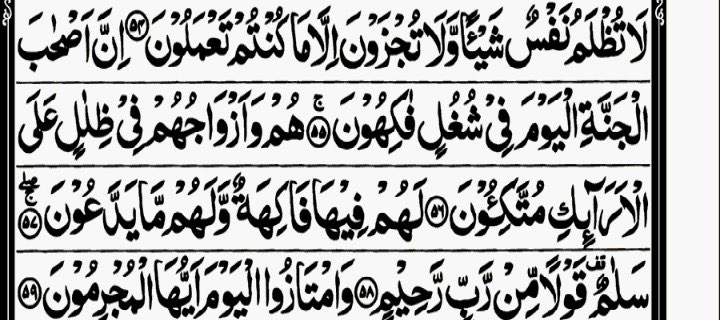
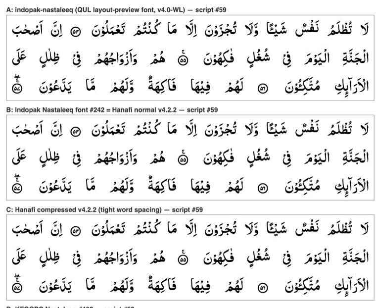
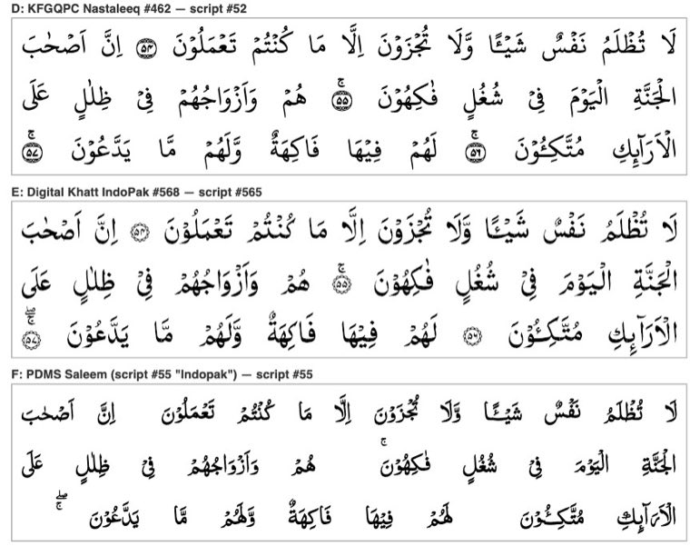

# Which QUL Indopak font best matches the Taj reference page?

Research for issue #3 (map: #1). Researched 2026-09-29 against QUL (https://qul.tarteel.ai), the font files on QUL's CDN, and the reference image `docs/QuranPage.jpg` (Taj Company 16-line, printed page 401, Surah Yasin 36:54–73).

## Answer

**Use QUL's "Indopak Nastaleeq font" (the QuranWBW / Ayman Siddiqui "AlQuran IndoPak" font) with QUL's "Indopak Nastaleeq script" word text (`text_indopak_nastaleeq`).**

- It is the font QUL itself uses to preview **both** Indopak layouts: "Indopak 16 lines layout (Taj company)" (layout 11) and "Indopak 15 lines layout (Qudratullah)" (layout 12). Both preview pages wrap the page in `class="mushaf mushaf-indopak-nastaleeq indopak-nastaleeq"`.
- In a side-by-side test against the reference it is the only candidate that gets all three of these right: the heavy South-Asian naskh letter shapes, a **plain circle with the ayah number inside**, and the **Taj-style waqf signs above the circle** (for example `ج` over 55, and `صلے` + `ج` over 57).
- It is a **single font file**, not one font per page. Size is about 80 KB as woff2 and 300 KB as ttf.
- **The licence is the blocker.** The font's own licence string says "NOT FOR SALE, NOT FOR MODIFICATION, NOT FOR DISTRIBUTION OR NOT FOR DEVELOPMENT WITHOUT WRITTEN NOTICE BY QURANWBW.COM". Before shipping it in the app we need written permission from quranwbw.com. See the licence section below.

The fallback with a clean licence is **Digital Khatt IndoPak** (SIL OFL 1.1). Its calligraphy is reasonable, but its ayah markers are rosettes, not Taj circles, and it is v0.1.

## Fonts QUL offers for Indopak

QUL lists 22 fonts under Resources → Fonts. Three are tagged Indopak. The Taj/Qudratullah layout previews also load a fourth, older build.

| # | QUL resource | File on QUL CDN (`https://static-cdn.tarteel.ai/qul/fonts/…`) | Formats (size) | Internal name / version | Licence (from font `name` table) | Script it expects |
|---|---|---|---|---|---|---|
| A | *(not a listed resource; loaded by the layout-11/12 previews as `indopak-nastaleeq`)* | `nastaleeq/indopak-nastaleeq-waqf-lazim.woff2` | woff2 (83 KB) | "AlQuran IndoPak by QuranWBW", Version 4.0-WL, 1117 glyphs | QuranWBW notice (see below) | Indopak Nastaleeq script (#59 WBW / #89 ayah) |
| B | **Indopak Nastaleeq font** — `/resources/font/242` (tags: Indopak, Unicode text, With Waqf Lazmi, Hafs) | `nastaleeq/Hanafi/normal-v4.2.2/with-waqf-lazmi/font.{ttf,woff,woff2}` | ttf 311 KB, woff 104 KB, woff2 79 KB | "AlQuran IndoPak by QuranWBW", name table says Version 2.100 (Nov 2022), 992 glyphs | QuranWBW notice | Indopak Nastaleeq script (#59 / #89) |
| B′ | variants loaded by QUL's CSS: `Hanafi/{compact,compressed}-v4.2.2`, `Madinah/{normal,compact,compressed}-v4.2.2` | same path pattern | woff2 about 79 KB each | Same outlines as B. Only the **space width** differs: normal 604, compact 312, compressed 153 units (UPM 2048). `Madinah/normal` is byte-identical to `Hanafi/normal`. | QuranWBW notice | same |
| C | **KFGQPC Nastaleeq** — `/resources/font/462` (tags: Quran Complex, Hafs, Indopak) | `nastaleeq/KFGQPCNastaleeq-Regular.{ttf,woff2}` | ttf 255 KB, woff2 86 KB | "KFGQPC Nastaleeq" v0.10 (2018), designer Alif Lam Mim Tech (Ashfaq A. Niazi), 1214 glyphs | KFGQPC EULA: free to use, copy and distribute; no sale, modification or reverse-engineering | QPC Nastaleeq script (#52 WBW, `text_qpc_nastaleeq_hafs`) |
| D | **Digital Khatt Indopak font** — `/resources/font/568` (tags: Digital khatt, Variable font, Hafs, Indopak) | `dk/DigitalKhattIndoPak.otf` | otf (CFF2) only, 495 KB | "DigitalKhatt IndoPak" Version 0.1, © 2024 Amine Anane / Tarteel | **SIL OFL 1.1** | Digital Khatt Indopak script (#565 WBW / #566 ayah) |
| (E) | *(not a font resource)* PDMS Saleem, loaded as `pdms-saleem` | `pdms-saleem-quranfont.ttf` | ttf 190 KB | "_PDMS_Saleem_QuranFont" v1.00 (2007) | PDMS commercial EULA | "Indopak" script (#55 / #90, tagged Pdms-saleem) |

Notes:
- The download buttons on QUL font pages open a sign-in modal (`data-url=/users/sign_in…`), so **downloading from QUL requires an account**. No account was created for this research. The CDN URLs above appear in each font page's "How to use" `@font-face` snippet and in QUL's CSS, and they returned HTTP 200 without authentication.
- **All of these are one font for the whole Quran.** Per-page fonts exist on QUL only for the Madani glyph sets (QPC V1/V2/V4, `p{N}-v1` and similar). The Taj layout preview uses a per-page CSS class (`p400-indopak-nastaleeq`), but no per-page `@font-face` sits behind it.

## Word-text encodings (36:54–57, fetched from `/resources/quran-script/{id}?ayah=36:NN`)

Each font is paired with its own script, and **they are not interchangeable**. The differences are in the sukun, yeh and ayah-end codepoints:

| Script (QUL id, `script_type`, `font_family`) | Sukun | Yeh | Ayah end (36:54) | Waqf |
|---|---|---|---|---|
| Indopak Nastaleeq #59 / #89 (`text_indopak_nastaleeq`, `indopak-nastaleeq`) | U+0652 | Farsi yeh U+06CC (`فِیْ`) | a separate "word": U+06DF + **PUA U+F535**, which the font draws as a circled number (54 → F535, 55 → F536, …) | U+06DA, U+06D6 appended after the marker (`۟ۚۖ`) |
| QPC Nastaleeq #52 (`text_qpc_nastaleeq_hafs`, `qpc-nastaleeq`) | U+0652 | Arabic yeh U+064A | Arabic-Indic digits `٥٤`, which the font ligates into a circle; some ayahs add U+FD94 | Encoded as U+FD94 after the digits |
| Digital Khatt Indopak #565 / #566 (`text_digital_khatt_indopak`, `digitalkhatt-indopak`) | U+0652 | U+064A | U+06DD + digits (`۝٥٤`) | U+06DA / U+06D6 after the number |
| "Indopak" #55 / #90 (`text_indopak`, font `indopak` = PDMS Saleem) | U+06E1 | U+064A / U+0649 | U+200F + space + digits `٥٤`. No U+06DD, so **no circle is drawn** | U+06DA / U+06D6 with U+200B |

Every script has JSON and SQLite downloads (also behind login). Each ayah record carries `page_number`, but that is the script's own default page. **Taj page mapping comes from the layout database** (see `docs/research/qul-indopak-layouts.md` on branch `research/qul-indopak-layouts`).

QUL numbers the Taj layout from the first content page, so the reference's printed **page 401 is QUL layout-11 page 400**. That page starts at "لَا تُظْلَمُ نَفْسٌ" and has the same line breaks as the reference.

## Visual comparison

Method: a local HTML page with `@font-face` for each candidate. Each candidate rendered lines 1–3 of the reference page (36:54 from word 2 through 36:57) from its own QUL script, broken where the reference breaks the lines (after `اَصْحٰبَ` and after `عَلَی`), justified, and viewed in Chrome.

Reference (Taj 16-line, printed p. 401, lines 1–4):

A (layout-preview font), B (font #242, Hanafi normal), and the Hanafi compressed variant, each with script #59:

KFGQPC Nastaleeq with script #52, Digital Khatt IndoPak with #565, and PDMS Saleem with #55:

| Criterion (reference) | Indopak Nastaleeq (A/B) | KFGQPC Nastaleeq | Digital Khatt IndoPak | PDMS Saleem |
|---|---|---|---|---|
| Letter shapes: heavy, bold South-Asian naskh with a large x-height | **Closest.** Similar stroke weight; kaf, final noon and alif-lam shapes match | Lighter and more calligraphic; closer to the KFGQPC Indo-Pak print than to Taj | Good naskh, but thinner and more "typeset" | Thin; spacing is uneven |
| Ayah marker: plain circle, number inside | **Match** (plain ring, Urdu/Persian digits) | Ornamented double ring | Rosette / floral medallion | **Not rendered.** The script has no U+06DD, so only a gap appears |
| Waqf above the marker (55: `ج`; 56: none; 57: `صلے` + `ج`) | **Match**: `ج` on 55, nothing on 56, `صلے`+`ج` on 57 | Wrong for Taj: `ج` on 56 as well, no `صلے` on 57 (follows the KFGQPC print) | Match (`ج` on 55; `صلے`+`ج` on 57) | Waqf floats above the last word, with no circle |
| Harakat style: Indo-Pak (sukun as a small `ْ` head, standing fatha `ٰ`, `ی` without dots) | Match | Match | Match | Match (uses U+06E1 sukun) |
| Word spacing: Taj is very tight, with words almost touching | Normal build is wider. The **compressed** build (space = 153/2048 em) is the closest to the Taj density; use it when justifying 16 lines | n/a | n/a | n/a |

A (v4.0-WL, the file QUL's own Taj preview uses) and B (the current #242 download) look the same in this sample.

## Licence details

- **Indopak Nastaleeq (QuranWBW, A/B).** The `name` table copyright reads "© Al Qalam © Ghandhara © KFGQPC © Ayman Siddiqui …". The licence description says the font is derived from the Al Qalam Quran Majeed fonts, and that the ayah-number glyphs come from the KFGQPC Nastaleeq font. It then says: *Made only for Sadaqa-e-Jaria purposes … NOT FOR SALE, NOT FOR MODIFICATION, NOT FOR DISTRIBUTION OR NOT FOR DEVELOPMENT WITHOUT WRITTEN NOTICE BY QURANWBW.COM* (contact: quranwbw@gmail.com). QUL's Credits page credits Ayman Siddiqui "for his amazing work on Indopak and tajweed fonts and script". QUL's FAQ says each resource's own licence governs use. **Bundling it in an app needs written permission from quranwbw.com**, and the upstream Al Qalam rights are unclear.
- **KFGQPC Nastaleeq.** KFGQPC EULA: free to use, copy and distribute; must not be sold, modified or reverse-engineered.
- **Digital Khatt IndoPak.** SIL OFL 1.1. This is the only candidate that is clearly safe to bundle.
- **PDMS Saleem.** A commercial Pakistan Data Management Services EULA. Not recommended.

## Unresolved

- **Permission to bundle the QuranWBW font.** It has to be requested from quranwbw.com; this research cannot settle it.
- **What "Hanafi" and "Madinah" mean.** QUL's CSS serves two build folders with those names. The `normal` files are byte-identical, so any difference would have to be in text or data, and we did not investigate it.
- **Coverage.** The comparison covered only lines 1–3 of one page. Other pages may show gaps in special marks, such as the ruku `ع` marker in the margin, the `وقف غفران` margin notes, and sajda signs. These are outside the word text and would need separate handling.
- **Harakat detail in the reference.** The reference image is a low-resolution phone screenshot, so we could not verify fine harakat details such as whether the fatha is present on every letter.
